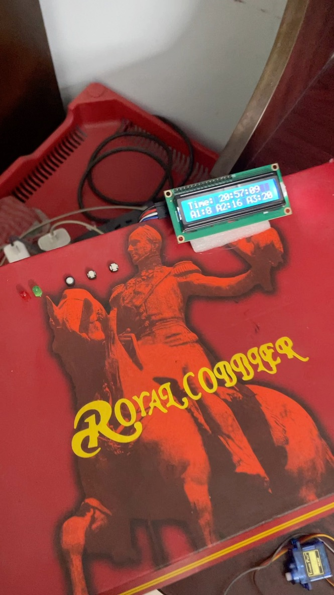
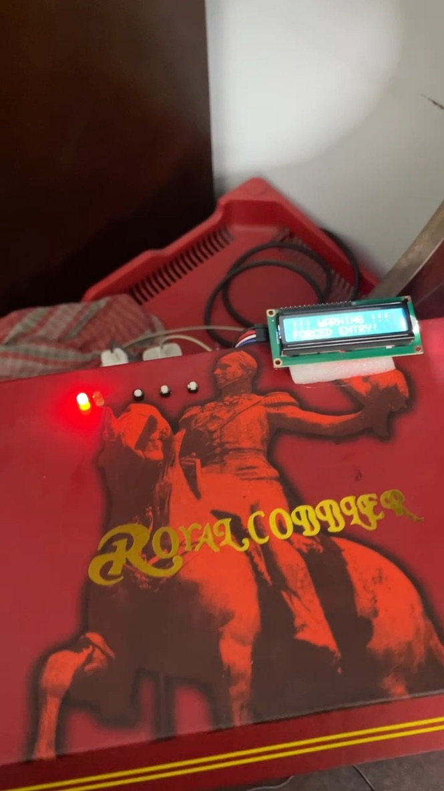
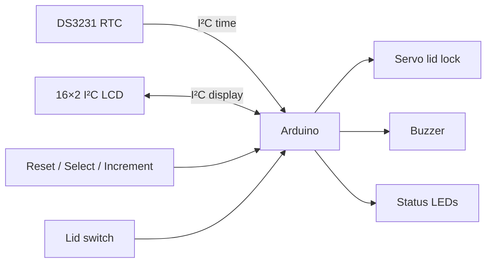
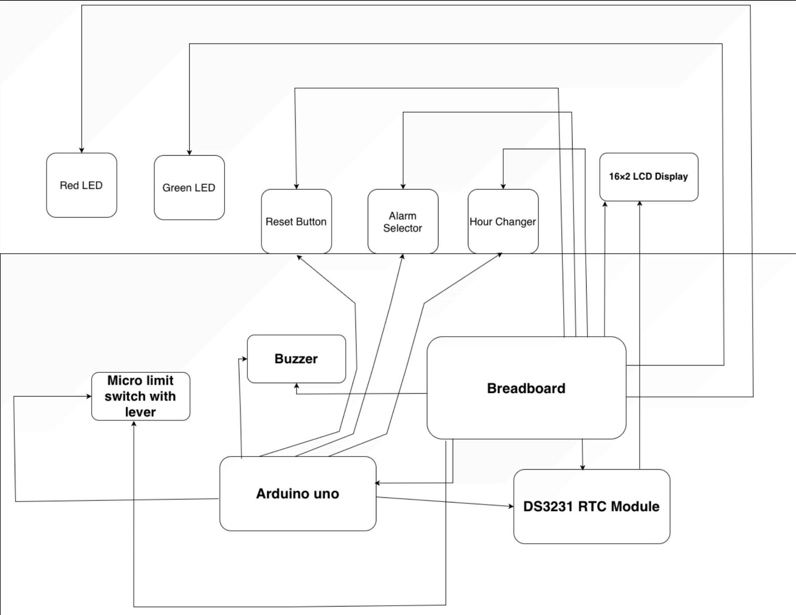
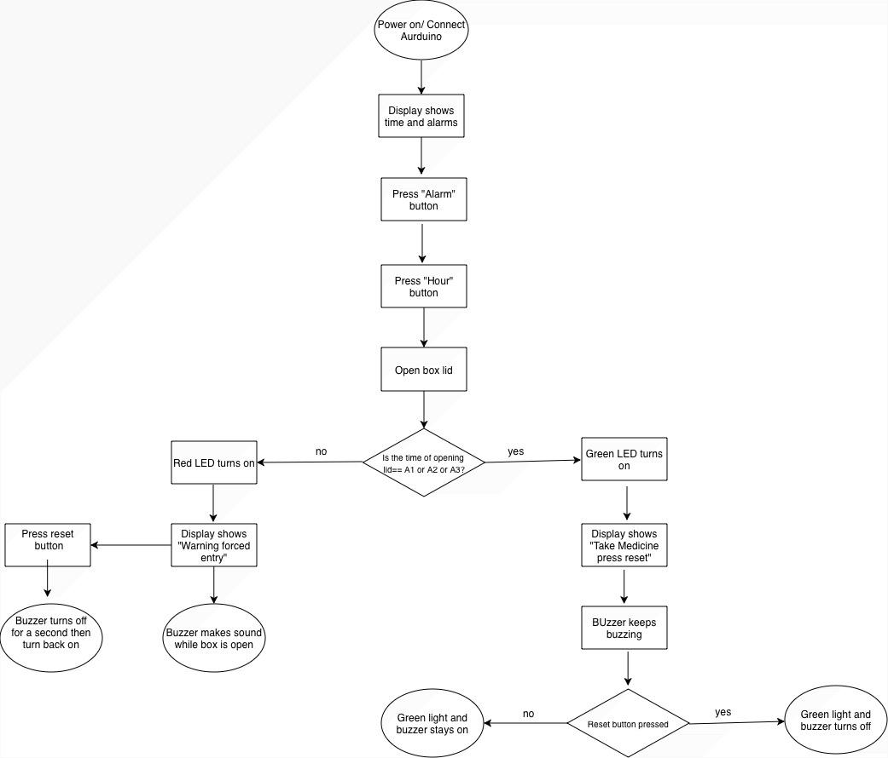
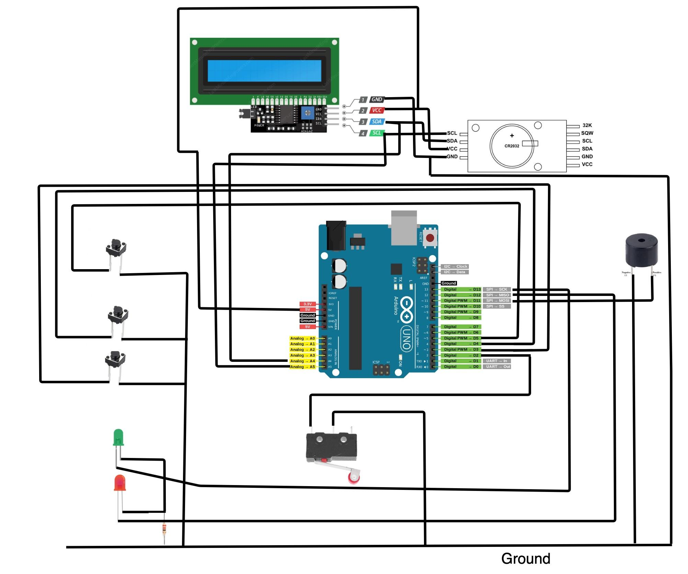

# Smart Pill Dispenser

An Arduino-based medication reminder and access-monitoring prototype that schedules three daily doses and warns when the enclosure is opened unexpectedly. This repository pairs the documented alert-only classroom build with enhanced firmware that also supports an optional servo-controlled lid.

<p align="center">
  
  &nbsp;
  
</p>

> [!IMPORTANT]
> This is an educational prototype, not a certified medical device. Do not rely on it for critical medication, dosage verification, child-resistant storage, or emergency care.

## What it does

- Keeps time with a DS3231 real-time clock (RTC).
- Supports three configurable daily reminder times.
- Supports optional servo unlocking when a reminder becomes due.
- Uses a lid switch to distinguish a scheduled opening from forced entry.
- Provides clear LCD, LED, and buzzer feedback.
- Automatically completes a reminder after the lid has been opened and closed.
- Uses non-blocking button handling so safety checks continue while the interface is active.

## System overview



## Project report and design artifacts

The complete CSE360 report, **Smart Medicine Reminder Box with Unauthorized Access Safety**, is available here:

- [Read the project report (PDF)](docs/report/Smart_Medicine_Reminder_Box_Project_Report.pdf)

The report documents the original classroom prototype, including its I²C/GPIO architecture, alert logic, cost breakdown, measured response time, limitations, and proposed improvements.

### System block diagram



### Process flowchart



### Circuit schematic



> [!NOTE]
> The report records that the demonstrated classroom build used buzzer/LED tamper detection and did **not** complete the physical servo lock. The firmware in this repository is an enhanced follow-up that adds optional servo locking on D9 while retaining the documented alert-based behaviour. The servo can be omitted if reproducing the reported prototype exactly.

## Operating states

| State | LCD / indicators | Behaviour |
|---|---|---|
| Ready | Current time and next dose | Lid remains locked. |
| Medicine due | Green LED and pulsed buzzer | Servo unlocks the lid. |
| Dose accessed | “Dose accessed” | Close the lid to complete the reminder and relock. |
| Tamper alert | Red LED and continuous high tone | Triggered if the lid opens outside a scheduled dose. |
| Settings | Selected alarm field flashes on the LCD | Select cycles fields; Increment changes the value. |

## Hardware

| Component | Purpose |
|---|---|
| Arduino-compatible board | Runs the controller firmware |
| DS3231 RTC module | Maintains date and time |
| 16×2 I²C LCD (`0x27`) | Displays time, alarms, and warnings |
| Hobby servo (optional enhancement) | Locks and unlocks the lid |
| Lid switch | Detects open/closed state |
| Active or passive buzzer | Audible reminder and tamper alert |
| Green and red LEDs | Visual status indicators |
| Three push buttons | Reset, field selection, and value increment |

See [Hardware and wiring](docs/HARDWARE.md) for the complete pin map and electrical notes.

## Getting started

1. Install the Arduino IDE or Arduino CLI.
2. Install these libraries using Library Manager:
   - **RTClib** by Adafruit
   - **LiquidCrystal I2C**
   - **Servo** (included with the Arduino AVR core)
3. Wire the modules according to [docs/HARDWARE.md](docs/HARDWARE.md).
4. Open `firmware/smart_pill_dispenser/smart_pill_dispenser.ino`.
5. Select your Arduino-compatible board and upload the sketch.
6. Confirm the RTC and LCD I²C addresses before first use.

If the RTC reports lost power, the firmware initializes it from the sketch compilation time. For precise setup, adjust the RTC once using an RTClib example or a dedicated clock-setting sketch.

## Controls

- **Select:** enter settings, then cycle through Alarm 1 hour/minute, Alarm 2 hour/minute, and Alarm 3 hour/minute.
- **Increment:** increase the selected value.
- **Reset:** acknowledge/cancel a reminder and relock a closed lid. During a tamper alert, close the lid before pressing Reset.
- Settings close automatically after 12 seconds of inactivity.

Alarm changes are stored in RAM and return to the defaults after a power cycle. See [User guide](docs/USER_GUIDE.md) for the full workflow.

## Repository structure

```text
.
├── firmware/
│   └── smart_pill_dispenser/
│       └── smart_pill_dispenser.ino
├── docs/
│   ├── media/
│   │   └── report/
│   ├── report/
│   │   └── Smart_Medicine_Reminder_Box_Project_Report.pdf
│   ├── HARDWARE.md
│   ├── SAFETY.md
│   └── USER_GUIDE.md
├── CITATION.cff
├── LICENSE
└── README.md
```

## Firmware improvements

The supplied prototype sketch has been reorganized into explicit operating states and includes:

- per-alarm hour **and minute** matching instead of one hard-coded minute;
- one trigger per scheduled minute;
- debounced, non-blocking button input;
- automatic relocking after a scheduled lid-open cycle;
- tamper-state priority over the settings screen;
- RTC power-loss recovery and serial diagnostics;
- fixed-width LCD rendering to prevent leftover characters.

## Limitations and next steps

- Alarm edits are not yet stored in EEPROM.
- The system detects lid opening, not whether the correct medicine or dosage was taken.
- There is no battery monitoring, connectivity, caregiver notification, or audit log.
- A production design would require a safer enclosure, independent power-failure behaviour, watchdog testing, and formal risk validation.

See [Safety and responsible use](docs/SAFETY.md) before extending or demonstrating the prototype.

## License

Released under the [MIT License](LICENSE).
